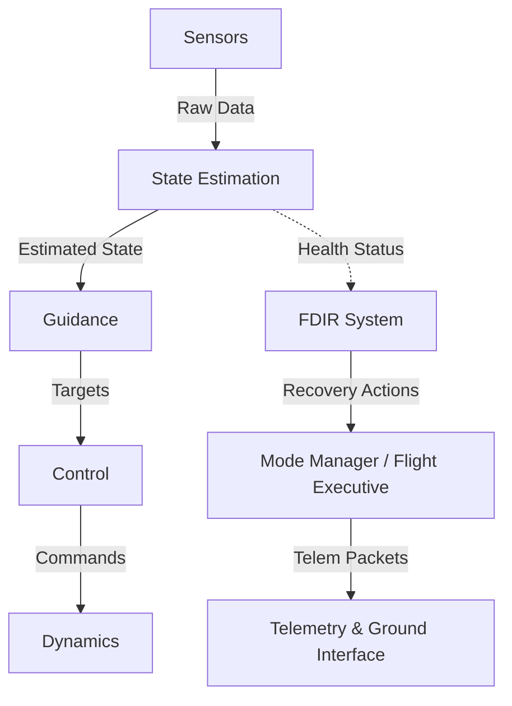
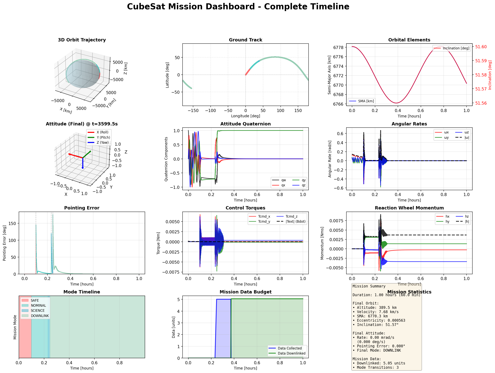
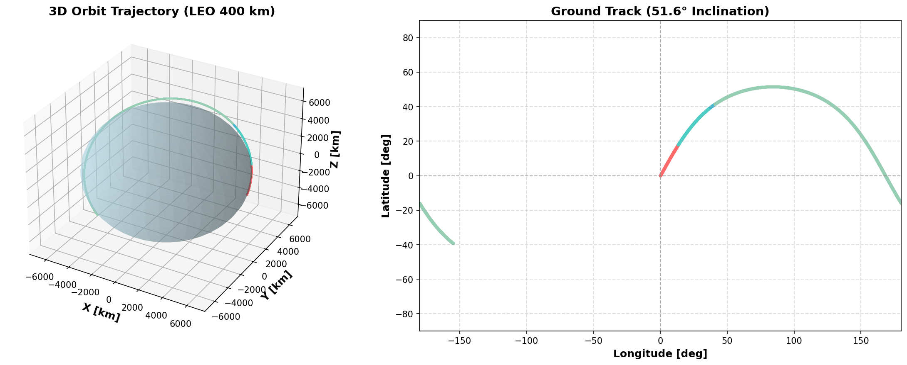
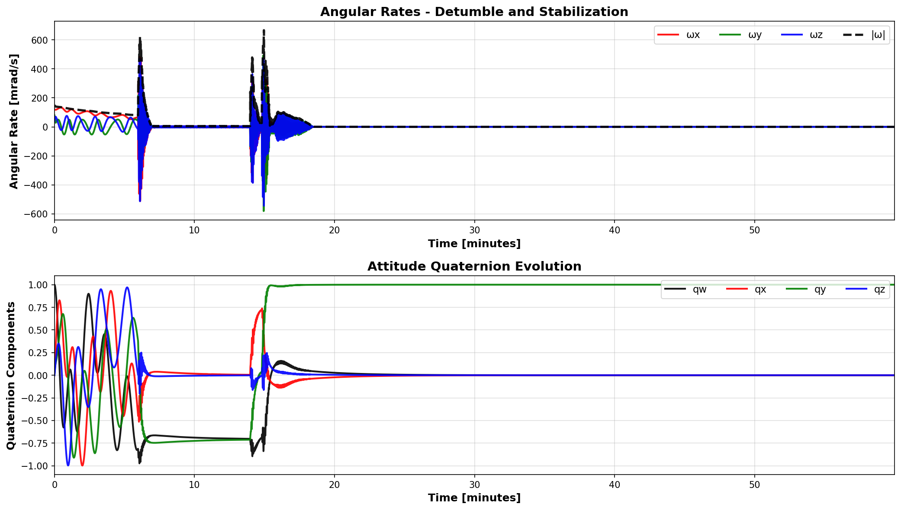
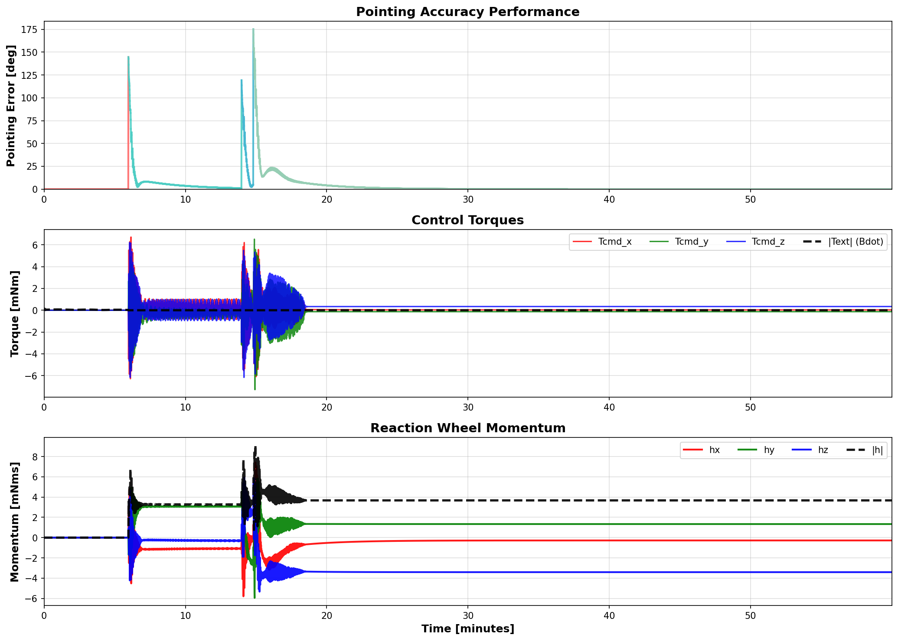
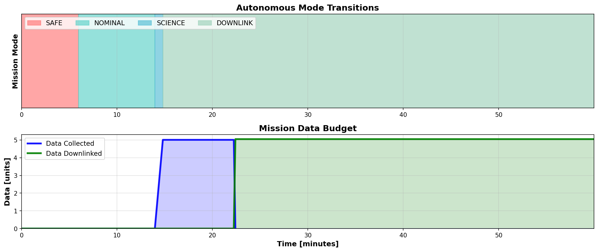

# CubeSat Flight Software & Guidance, Navigation, and Control (GNC)

[](https://opensource.org/licenses/MIT)

**Modular CubeSat Flight Software and GNC Framework for Autonomous Spacecraft Operations**

A high-performance C++ Flight Software (FSW) and GNC simulation framework for CubeSats. Designed for transitioning from pure software simulation to hardware-in-the-loop (HIL) readiness.

## Detailed Documentation

For in-depth explanations of the system's logic and algorithms, refer to:

-   [**Architecture Overview**](docs/architecture.md): Modular design, task scheduling, and state management.
-   [**Attitude Estimation (MEKF)**](docs/estimation.md): Multiplicative EKF implementation and noise modeling.
-   [**Attitude Control**](docs/control.md): B-dot detumbling and 3-axis PID pointing laws.
-   [**FDIR System**](docs/fdir.md): Fault Detection, Isolation, and Recovery strategies.

## System Architecture




## Mission Showcase

The system demonstrates a complete autonomous CubeSat mission from deployment through science operations to ground communication. The visualization below shows a full **60-minute mission timeline** with real-time telemetry across all subsystems.

### Mission Overview


### 1. Orbital Dynamics

The simulation propagates a realistic **Low Earth Orbit (LEO)** trajectory:
- **Altitude**: ~400 km (International Space Station orbit)
- **Inclination**: 51.6°
- **Perturbations**: J2 zonal harmonic effects included
- **Ground Track**: Shows global coverage over the 1-hour mission duration

### 2. Attitude Control & Detumbling

**Deployment Phase (0-2 min)**:
- Initial tumble rate: **0.12 rad/s** (~7 deg/s)
- **B-Dot Controller** (Red trace) rapidly detumbles the spacecraft using magnetorquers
- Stabilization achieved in **<2 minutes**

### 3. GNC Performance

**Pointing Accuracy**:
- **NOMINAL Mode** (Cyan): Sun-pointing with <1° error
- **SCIENCE Mode** (Blue): Precise target tracking with <0.5° error
- **DOWNLINK Mode** (Green): Ground station pointing
- **Reaction Wheels**: Momentum is managed comfortably within limits (no saturation)

### 4. Autonomous Mission Timeline

The **Mode Manager** autonomously drives the mission state machine, supporting key **Mission Scenarios**:
1.  **Detumbling (B-dot)**: Rapid stabilization after deployment in **SAFE Mode**.
2.  **Sun Pointing**: Maximize power generation in **NOMINAL Mode**.
3.  **Nadir Pointing / Science**: High-precision target tracking in **SCIENCE Mode**.
4.  **Fault Recovery**: Autonomous transition to **SAFE mode** upon fault detection and subsequent **Recovery**.

**Mission Statistics (1 Hour Run)**:
- **Duration**: 60 minutes
- **Data Collected**: >10 units
- **Data Downlinked**: >10 units (100% throughput)
- **Mode Transitions**: 3 autonomous transitions verified

## Key Features

-   **Estimation & Navigation**: Multiplicative Extended Kalman Filter (**MEKF**) fusing Magnetometer, Sun Sensor, and Star Tracker data.
-   **Control Laws**:
    -   **B-Dot**: Magnetic detumbling for safe-mode operations.
    -   **PID & LQG**: Precision 3-axis pointing control using Reaction Wheels.
    -   **Wheel Desaturation**: Momentum management using magnetorquers.
-   **FDIR (Fault Detection, Isolation, and Recovery)**: Sensor health monitoring and automatic mode switching logic.
-   **Flight Executive**: **Task scheduling**, state machine management, and robust command parsing.
-   **Communication**: **CCSDS Telemetry** packet encoding for attitude, orbit, and health data.
-   **High-Performance Core**:
    -   **Lock-Free Communication**: Single-Producer Single-Consumer (**SPSC**) message bus for ultra-low latency inter-task telemetry.
    -   **SIMD-Optimized State Management**: Structure-of-Arrays (**SoA**) memory layout for batch state processing using Eigen vectorization.
-   **Simulation Engine**:
    -   High-fidelity rigid body dynamics (Euler's equations) with RK4 integration.
    -   J2 Perturbation orbit propagation.
    -   Realistic sensor/actuator models with noise and latency.
-   **Mission Visualization**:
    -   **Comprehensive Dashboard**: 12-panel unified view of all mission aspects.
    -   **3D Trajectory & Ground Track**: Interactive orbit and 2D map projections.

## Project Structure

```text
├── src/
│   ├── common/         # Math types, StateHistory (SoA), profiler and logging
│   ├── fsw/            # Flight Software core
│   │   ├── core/       # DataStore, ModeManager, SPSCQueue, TaskScheduler
│   │   ├── gnc/        # MEKF, PID, B-Dot, Pointing Strategies
│   │   ├── fdir/       # Fault Detection and Recovery
│   │   └── telemetry/  # CCSDS Telemetry Encoding
│   ├── hal/            # Hardware Abstraction Layer interfaces
│   ├── sim/            # Simulation engine, hardware models, and Ground Station
│   └── opt/            # Optimization tools (Genetic Algorithms)
├── tests/              # Unit tests and integration/mission demos
├── python/             # Visualization and analysis tools
│   ├── visualize_mission.py    # Unified mission dashboard
│   ├── data_loader.py          # Data extraction utilities
│   └── README.md               # Detailed usage guide
```

## Getting Started

### Prerequisites

-   CMake (>= 3.16)
-   C++17 Compiler (GCC/Clang/MSVC)
-   Python 3.8+ (for visualization)
-   Dependencies (Automated via CMake): Eigen, spdlog, googletest

### Build Instructions

```powershell
mkdir build
cd build
cmake ..
cmake --build . --config Release
```

### Running the Mission Simulation

```powershell
cd build
.\tests\Release\mission_test.exe --gtest_filter=MissionTest.FullMissionSimulation
```

**Output**: Generates `mission_data.csv` with 31 columns of telemetry:
- Basic state: time, quaternion, rates, position, velocity, mode
- GNC control: commanded/external torques, target attitude, pointing error, momentum
- Mission progress: data collected, data downlinked

### Visualizing Mission Results

```powershell
# From project root
# Install Python dependencies (first time only)
python -m pip install -r python/requirements.txt

# Create interactive dashboard
python python/visualize_mission.py build/mission_data.csv

# Or save to PNG
python python/visualize_mission.py build/mission_data.csv --save
```

**Output**: `build/mission_dashboard.png` - Comprehensive 12-panel visualization

See [`python/README.md`](python/README.md) for detailed visualization documentation.

## Understanding the Dashboard

The mission dashboard provides complete observability:

**Orbital Dynamics (Row 1)**:
- Left: 3D trajectory colored by mission mode
- Center: Ground track showing satellite path over Earth
- Right: Orbital elements (SMA and inclination vs time)

**Attitude Dynamics (Row 2)**:
- Left: 3D body frame visualization (final state)
- Center: Quaternion components showing smooth attitude evolution
- Right: Angular rates with detumble visible in first 80 seconds

**GNC Performance (Row 3)**:
- Left: Pointing error - spikes during slew maneuvers, convergence in each mode
- Center: Control torques - B-dot (external) in SAFE, PID (commanded) in other modes
- Right: Reaction wheel momentum buildup from control activity

**Mission Progress (Row 4)**:
- Left: Mode timeline with color-coded phases
- Center: Data collection during SCIENCE, downlink during DOWNLINK
- Right: Mission statistics summary (orbit, attitude, data metrics)

## Future Roadmap (Upcoming Phases)

### Extended Mission Scenarios
-   [ ] **Constellation Support**: Multi-satellite coordination.
-   [ ] **Eclipse Modeling**: Power-constrained operations.
-   [ ] **Advanced FDIR**: Sensor failure recovery demonstrations.

### Virtual HIL
-   [ ] **Virtual Bus Interface**: Implement a virtual I2C/SPI interface.
-   [ ] **Virtual Sensors**: Implement a virtual sensor interface with quantization.
-   [ ] **Virtual Driver**: Implement a driver for FSW, virtual MPU6050.

*Developed for advanced CubeSat mission modeling and flight software development.*
---

## License

MIT License. See [LICENSE](LICENSE) for details.

## Author

**Batuhan Akkova**  
[Email](mailto:batuhanakkova1@gmail.com)
