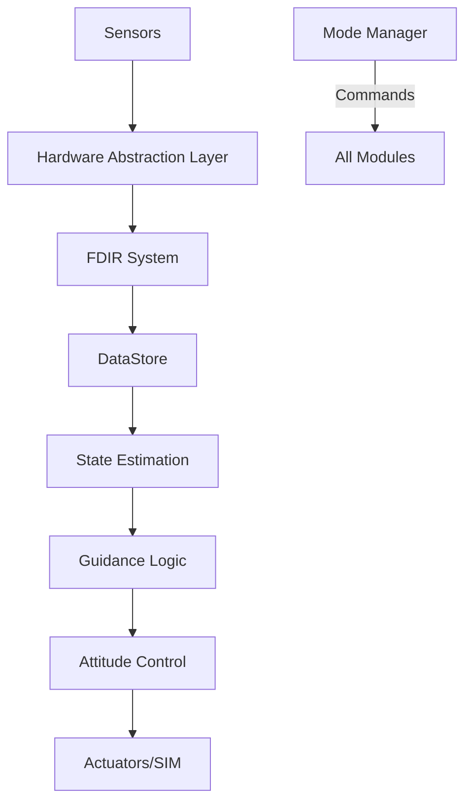

# Flight Software Architecture

This document provides a high-level overview of the CubeSat Flight Software (FSW) architecture.

## System Overview

The FSW is built on a modular, event-driven architecture designed for high reliability and autonomous operation. It consists of several core services and functional modules.

### Core Services

- **TaskScheduler**: Manages the cyclic and asynchronous execution of software tasks. It ensures that critical GNC tasks run at deterministic intervals (e.g., 10 Hz for estimation and control).
- **ModeManager**: Implements the mission state machine. It handles transitions between mission modes:
  - `SAFE`: Initial state, detumbling with B-dot control, minimal power consumption.
  - `NOMINAL`: Periodic operations, sun-pointing for power generation.
  - `DEGRADED`: Critical systems degraded, reduced mission objectives.
  - `SCIENCE`: Mission-specific operations (e.g., nadir pointing, data collection).
  - `DOWNLINK`: Communication with ground station.
- **DataStore**: A centralized repository for inter-module communication. It follows a publish-subscribe or direct-access model to decouple modules. Includes a **Lock-Free SPSC Message Bus** for high-frequency telemetry data to minimize cycle-to-cycle latency.

### Functional Modules

- **GNC (Guidance, Navigation, and Control)**: The "brain" of the spacecraft.
  - **Estimation**: Uses a Multiplicative Extended Kalman Filter (MEKF) to maintain an accurate attitude estimate.
  - **Guidance**: Computes the target attitude based on mission objectives (e.g., Slew to Nadir).
  - **Control**: Implements 3-axis PID and B-dot control laws to actuate the spacecraft.
- **FDIR (Fault Detection, Isolation, and Recovery)**: Monitors system health and executes autonomous recovery actions.
- **Telemetry Service**: Packages and sends spacecraft health and science data to the ground station using CCSDS-like protocols.

## Data Flow

## Performance Optimizations

### Lock-Free Communication (SPSC)

For performance-critical paths (e.g., Sensor ingestion, Telemetry streaming), the system uses a **Single-Producer Single-Consumer (SPSC)** lock-free queue. This eliminates mutex contention and context switching overhead:
- **Head/Tail atomics**: Uses `std::atomic` with memory barriers.
- **Cache-line padding**: Prevents "false sharing" by aligning pointers to 64-byte boundaries.

### SIMD-Optimized State Management (SoA)

The `StateHistory` service utilizes a **Structure-of-Arrays (SoA)** memory layout. Unlike standard Array-of-Structures (AoS), this layout stores each state component (e.g., all X-coordinates) contiguously in memory.
- **Eigen Vectorization**: This allows the compiler and Eigen to utilize **SIMD (Single Instruction, Multiple Data)** instructions.
- **Throughput**: Verified to achieve sub-nanosecond processing times per sample for statistical operations (mean, variance, filter).

## Task Execution

The `TaskScheduler` runs a main loop where it checks for scheduled tasks:
- **Fast Loop (10 Hz)**: GNC (Estimation + Control).
- **Medium Loop (1 Hz)**: FDIR monitoring, Telemetry heartbeat.
- **Slow Loop (0.1 Hz)**: Orbit propagation, Thermal checks.
